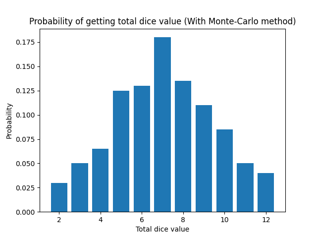
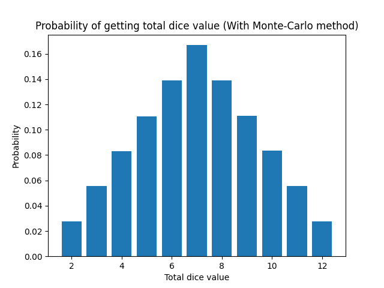

# Результати виконання алгоритму моделювання кидання двох ігрових кубиків за допомогою методу Монте-Карло

## Порівняльний аналіз ймовірностей при киданні двох кубиків:

| Сума   | Еталон        | Монте-Карло (100) | Монте-Карло (1000) | Монте-Карло (10 000) | Монте-Карло (100 000) | Монте-Карло (1 000 000) | 
|--------|---------------|-------------------|--------------------|----------------------|-----------------------|-------------------------|
| 2      | 2.78% (1/36)  | 2%                | 2.40               | 2.87                 | 2.83                  | 2.77                    |
| 3      | 5.56% (2/36)  | 4.5%              | 4.70               | 5.32                 | 5.44                  | 5.54                    |
| 4      | 8.33% (3/36)  | 11.00%            | 8.00               | 8.50                 | 8.49                  | 8.32                    |
| 5      | 11.11% (4/36) | 11.00%            | 11.30              | 11.24                | 11.13                 | 11.07                   |
| 6      | 13.89% (5/36) | 14.5%             | 14.2               | 13.54                | 13.95                 | 13.89                   |
| 7      | 16.67% (6/36) | 23.5%             | 21.00              | 16.72                | 16.7                  | 16.69                   |
| 8      | 13.89% (5/36) | 15.00%            | 15.30              | 14.86                | 13.8                  | 13.91                   |
| 9      | 11.11% (4/36) | 8.50%             | 6.90               | 10.81                | 11.05                 | 11.11                   |
| 10     | 8.33% (3/36)  | 4.00%             | 9.00               | 7.93                 | 8.27                  | 8.34                    |
| 11     | 5.56% (2/36)  | 3.50%             | 4.30               | 5.4                  | 5.52                  | 5.57                    |
| 12     | 2.78% (1/36)  | 2.50%             | 2.90               | 2.81                 | 2.81                  | 2.78                    |

## Графічне представлення результатів виконання алгоритму при 100 симуляціях:

## Графічне представлення результатів виконання алгоритму при 1 000 000 симуляціях:

# Висновок:

Було створено таблицю з порівнянням результатів кидків двох кубиків та ймовірностей отримання результату в залежності від кількості симуляцій: 
З отриманих розрахунків можна побачити, що результати наближаються до еталонних зі збільшенням кількості симуляцій. 

Отримані дані повністю підтверджують переваги та недоліки методу Монте-Карло: 
Найгірший результат виявився при 100 симуляціях, в той час, як 1 000 000 симуляцій дали результат близький до еталонного; 
Також це чудово відображається на графіках представлених вище.